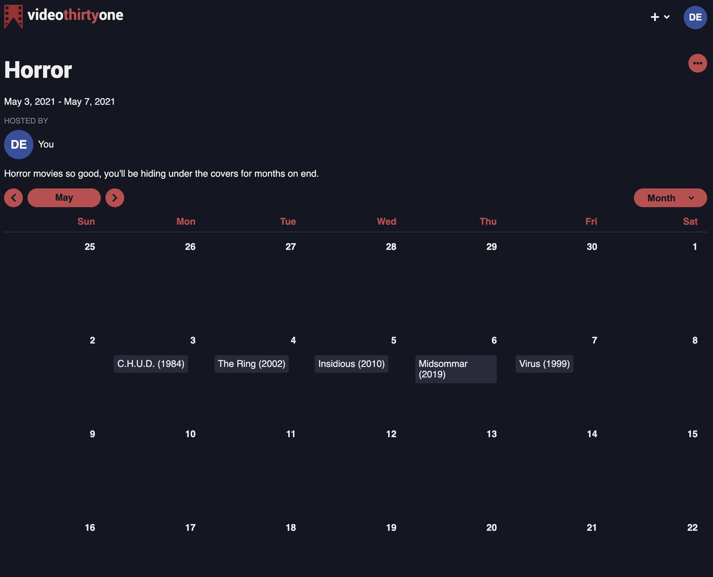

# Video Thirty One
Video Thirty One is a book club for films where friends can create and follow curated collections of films they want to watch. The live site can be found [here](https://pick-list.herokuapp.com/).

## Why I built it
1. It is meant to showcase my wide variety of technical and design skills.
2. More importantly, it's for my wife.

## Origin
Every October, my wife creates a list of 31 horror movies to watch during the month, one per day. The word spread quickly and every year more friends and family wanted to follow along and watch the films with us. So we needed a way to easily share the list, make live updates, and have the information about each film automatically integrated.

For October 2020, I decided to take the opportunity to see if I could build a website to solve these problems. I had no knowledge of JavaScript and only a cursory understanding of both HTML and CSS. It took me about a month, but I did make... *something*. It is still live at [31horrors.com](https://31horrors.com) as a github pages site. [Here's](https://github.com/breizeway/31-horrors) the repository. It met almost none of my goals, but I learned a lot in the process and I had so much fun that it overwhelmingly affirmed my decision to switch up my career and become a full-stack software engineer.

After I took the time to learn JavaScript, React, Redux (and [much more](https://tannorbreitigam.com/technologies)), I felt it was time to revisit the project and build something that would actually meet those goals. Enter Video Thirty One--the "Thirty One" of course being a nod to the 31 days of October. With Video Thirty One, anyone can create a list like our yearly 31 Horrors lists, but with any theme, any film, and for any time period. More importantly, my wife can build her list every year and share it with our family and friends.

## Technical Details
### Highlights
- Optimized load speed by building Redux state to first load database data then film API data only as needed and React to reduce repetitive code and increase render speed
- Utilized pure CSS to design a uniquely styled front end from the ground-up for a pleasant UX
- Implemented a robust user authentication system using Flask-Login with extensive error handling

### Technologies Used
- JavaScript on the front end
- React to enable fast renders and allow for the creation of easily reusable components
- Redux to keep track of the state of the application
- Redux Thunk to add middleware to the Redux flow that would allow me to create asynchronous request to the back end in the dispatch process
- React Router Dom to manage front end routes
- Python on the back end
- Flask to run the server
- Flask Login to manage user authentication
- SQLAlchemy to create data models and interact with the database

### The Calendar


When you open a list in v31, you are presented with an arrangement of films in a calendar view. This design decision meant that I had to implement a complete calendar component within my site. When I first built the calendar, I had all the logic laid out haphazardly in a group of functions responsible for changing the date, showing a month vs week, etc. It quickly became confusing an overly complicated. I could have integrated any number of packages that would easily add calendar functionality, but I decided instead to create a [calendar class](https://github.com/breizeway/v31/blob/main/react-app/src/services/calendar.js). It's maintained and updated through Redux, then initiated in the calendar component to render an array of "day" components for each day in the week or month.

`Calendar` has a property called `days` which is an array of objects, each object representing one day. Each object contains information about that calendar date. The list only includes the days and number of days as specified by the `view` and `rootDate` properties that, when updated by the user, will update the `days` property and re-render the correct days to display to the user.

### Dropdowns and Modals
Having chosen to use React on the front end, I made an effort to create reusable components as much as possible. Two of the most versatile and interesting components I created where my custom `DropDown` and `Modal` components. You can see the `DropDown` component being used when you select the options button on either a list or a film pick and for the autocomplete feature when searching or a new film. The `Modal` component is used whenever you view a film, log in, or create a new list. The logic used to open/close and otherwise manage their state is almost identical, so I'll discuss the `DropDown` component only.

I'm using the `DropDown` slice of state to simply keep track of which unique `DropDown` component (or none) is currently the active one and therefore visible. When the user clicks on a button that should a show a dropdown, an action is dispatched to the Redux store that updates the `active` property of the `DropDown` state with the unique identifier for the dropdown menu that should now be visible. An event listener that listens for a click is also created. On the next click, another action will be dispatched that will set the active identifier to `null` or to a new identifier, depending on the click target. Any component that can trigger the visibility of a drop down menu uses the `DropDown` component with a ternary condition that specifies that the `DropDown` does not exist unless the active identifier in state matches the id for the `DropDown` component defined in that parent component.

Take a look at the [ListTitle](https://github.com/breizeway/v31/blob/main/react-app/src/components/List/ListTitle/index.js) component for an example. Here's an excerpt:

```jsx
<div>
    <IconButton content='fas fa-ellipsis-h' action={() => dropDown.set()}/>
    {dropDown.val === dropDown.thisVal && (
        <DropDown options={dropDown.options} justify='right'/>
    )}
</div>
```

## Custom event propagation management
I encountered a situation where I wanted to put a control in the dropdown menu that, when clicked, would toggle the control and *not* trigger the event listener to close the dropdown menu. I tried to use the `stopPropagation` method on the `event` object, but it stopped all clicks in that area and would no longer trigger the toggle.

I came up with a clever custom solution. For any area that should not trigger the event listener that hides the drop down menu, the parent element for that area is given the class `dropdown-prevent-close`. The callback function in the event listener has a conditional that checks if any parent element has that class. If one does, the event callback just returns and does nothing. If it does not, the active drop down menu is removed and the menu is hidden.

To determine if an ancestor has a certain class, I created a function called `parentHasClass` which takes in an element and a string and recursively creates an array of all classes associated with elements from its parent, all the way back to `HTML` element. It uses the `parentElement` and `classList` properties on the `event` object.

```js
const getAllParentClasses = (target, classes=[]) => {
    const parent = target.parentElement
    if (!parent) return classes


    const targetClasses = Array.from(target.classList)
    classes = classes.concat(targetClasses)

    return getAllParentClasses(parent, classes)
}

export const parentsHaveClass = (target, classStr) => {
    return getAllParentClasses(target).includes(classStr)
}
```

To see this in use, you can create a new list and hit the publish toggle in the list options menu and notice that any click in the publish section of the menu has no effect on the visibility of the dropdown.

## Getting started

1. Clone this repository

   ```bash
   git clone https://github.com/breizeway/v31.git
   ```

2. Install dependencies

      ```bash
      pipenv install --dev -r dev-requirements.txt && pipenv install -r requirements.txt
      ```

3. Create a **.env** file based on the example with proper settings for your development environment
4. Setup your PostgreSQL user, password and database and make sure it matches your **.env** file
5. Get into your pipenv, migrate your database, seed your database, and run your flask app

   ```bash
   pipenv shell
   ```

   ```bash
   flask db upgrade
   ```

   ```bash
   flask seed all
   ```

   ```bash
   flask run
   ```

6. To run the React App in development, checkout the [README](./react-app/README.md) inside the `react-app` directory.

***
*IMPORTANT!*
   If you add any python dependencies to your pipfiles, you'll need to regenerate your requirements.txt before deployment.
   You can do this by running:

   ```bash
   pipenv lock -r > requirements.txt
   ```

*ALSO IMPORTANT!*
   psycopg2-binary MUST remain a dev dependency because you can't install it on alpine-linux.
   There is a layer in the Dockerfile that will install psycopg2 (not binary) for us.
***

## Deploying to Heroku
1. Create a new project on Heroku
2. Under Resources click "Find more add-ons" and add the add on called "Heroku Postgres"
3. Install the [Heroku CLI](https://devcenter.heroku.com/articles/heroku-command-line)
4. Run

   ```bash
   heroku login
   ```

5. Login to the heroku container registry

   ```bash
   heroku container:login
   ```

6. Update the `REACT_APP_BASE_URL` variable in the Dockerfile.
   This should be the full URL of your Heroku app: i.e. "https://flask-react-aa.herokuapp.com".
7. Push your docker container to heroku from the root directory of your project. This will build the dockerfile and push the image to your heroku container registry.

   ```bash
   heroku container:push web -a {NAME_OF_HEROKU_APP}
   ```

8. Release your docker container to heroku

   ```bash
   heroku container:release web -a {NAME_OF_HEROKU_APP}
   ```

9. Set up your database:

   ```bash
   heroku run -a {NAME_OF_HEROKU_APP} flask db upgrade
   heroku run -a {NAME_OF_HEROKU_APP} flask seed all
   ```

10. Under Settings, find "Config Vars" and add any additional/secret .env variables
